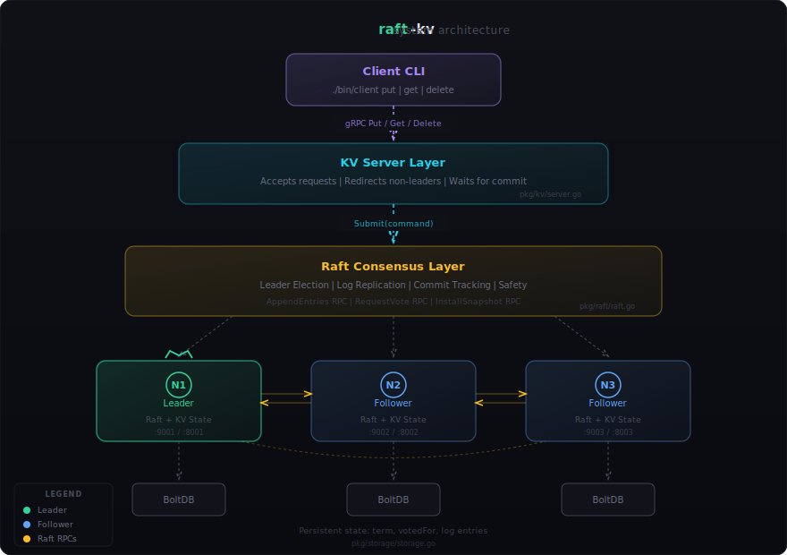

# RaftKV

A distributed, fault-tolerant key-value store built from scratch in Go, implementing the [Raft consensus algorithm](https://raft.github.io/raft.pdf).

Includes an **interactive browser-based visualization** of the protocol — [try it live](#visualization).

---

## Why This Project

Building a consensus algorithm from the ground up is one of the best ways to deeply understand distributed systems. This project implements the core Raft protocol — leader election, log replication, and safety guarantees — without relying on any existing Raft library. Everything from the state machine to the gRPC transport layer is written by hand.

**Key properties:**
- **Strong consistency** — linearizable reads and writes
- **Fault tolerance** — cluster survives ⌊(n-1)/2⌋ node failures
- **Persistent storage** — BoltDB-backed durable state across restarts
- **gRPC networking** — Protocol Buffer-defined RPCs for both cluster and client communication
- **Comprehensive testing** — test harness simulates partitions, leader crashes, and split-brain scenarios

## Architecture

<p align="center">
  
</p>

### How a write flows through the system

1. Client sends `Put(key, value)` via gRPC to any node
2. Non-leaders redirect to the current leader
3. Leader appends command to its log and replicates via `AppendEntries` RPC
4. Once a majority of nodes acknowledge, the entry is **committed**
5. All nodes apply the committed entry to their in-memory state machine
6. Client receives success

## Raft Implementation

The Raft layer implements the full protocol from [Section 5 of the paper](https://raft.github.io/raft.pdf):

| Component | Description |
|-----------|-------------|
| **Leader Election** | Randomized election timeouts (150-300ms). Candidate requests votes; majority wins. At most one leader per term. |
| **Log Replication** | Leader replicates entries via `AppendEntries`. Heartbeats sent every 50ms. Follower logs are reconciled on conflict. |
| **Safety** | Election restriction ensures only up-to-date candidates win. Committed entries are guaranteed in all future leaders. |
| **Persistence** | Current term, voted-for, and log entries are durably stored in BoltDB before responding to RPCs. |

### Safety properties enforced

- **Election Safety** — at most one leader per term
- **Leader Append-Only** — leaders never overwrite or delete log entries
- **Log Matching** — same index + term implies identical logs up to that point
- **Leader Completeness** — committed entries appear in all future leaders
- **State Machine Safety** — all nodes apply the same commands in the same order

## Project Structure

```
raft-kv/
├── cmd/
│   ├── server/             Server entrypoint (starts Raft + KV gRPC servers)
│   └── client/             CLI client for Put/Get/Delete operations
├── pkg/
│   ├── raft/               Core consensus: state machine, elections, replication
│   │   ├── raft.go         Main Raft implementation (~330 lines)
│   │   └── log.go          Log management and persistence
│   ├── kv/                 Key-value state machine + gRPC service
│   ├── transport/          gRPC transport layer + Protocol Buffer definitions
│   ├── storage/            BoltDB (production) and in-memory (test) backends
│   └── testharness/        Cluster simulation, network partitions, failure scenarios
├── viz/                    Interactive browser visualization
├── configs/cluster.yaml    Cluster configuration (timeouts, ports, storage)
├── scripts/                Cluster management and benchmarking scripts
├── Makefile                Build, test, and run targets
└── go.mod
```

## Getting Started

### Prerequisites

- **Go 1.21+**
- **protoc** (Protocol Buffers compiler) — `brew install protobuf` on macOS
- **gRPC Go plugins** — `go install google.golang.org/protobuf/cmd/protoc-gen-go@latest && go install google.golang.org/grpc/cmd/protoc-gen-go-grpc@latest`

### Build and run

```bash
make deps          # download Go dependencies
make build         # compile → bin/server, bin/client

make run-cluster   # start a 3-node local cluster (ports 9001-9003)
```

### Use the client

```bash
./bin/client put name "aarush"      # write a key
./bin/client get name               # read it back
./bin/client delete name            # remove it

# target a specific node
RAFTKV_SERVER=localhost:9002 ./bin/client get name
```

### Stop

```bash
make stop-cluster
```

## Testing

```bash
make test            # all tests with race detector
make test-raft       # raft consensus tests only
make test-harness    # fault-tolerance scenario tests
make bench           # benchmarks
```

The test harness programmatically creates clusters and injects failures:

```go
cluster, _ := testharness.NewCluster(nil)
defer cluster.Shutdown()

leader, _ := cluster.WaitForLeader(5 * time.Second)
cluster.DisconnectNode(leader.ID)              // kill the leader
newLeader, _ := cluster.WaitForLeader(5 * time.Second) // new one elected

cluster.PartitionNetwork([]uint64{1}, []uint64{2, 3})  // network split
cluster.HealPartition()                                 // reconnect
```

## Visualization

The `viz/` directory contains a **self-contained interactive visualization** of the Raft protocol running entirely in the browser (no backend required).

**Open it:** `open viz/index.html` or deploy to GitHub Pages.

**What you can do:**
- Watch leader election happen in real-time with animated vote requests
- Click any node to kill/restart it and observe re-election
- Send `Put`/`Get` operations and watch log replication across nodes
- Create network partitions and see split-brain prevention in action
- Adjust simulation speed

Each node displays its state (Follower/Candidate/Leader), current term, and election timeout countdown. Messages between nodes are animated as colored dots — yellow for votes, purple for log entries, blue for heartbeats.

## Tech Stack

| Component | Technology |
|-----------|-----------|
| Language | Go 1.24 |
| RPC | gRPC + Protocol Buffers |
| Persistence | BoltDB (bbolt) |
| Visualization | Vanilla HTML/CSS/JS + Canvas API |

## References

- [In Search of an Understandable Consensus Algorithm](https://raft.github.io/raft.pdf) — Ongaro & Ousterhout, 2014
- [Raft Interactive Visualization](https://raft.github.io/)
- [MIT 6.5840 (6.824)](https://pdos.csail.mit.edu/6.824/) — Distributed Systems

## License

MIT
